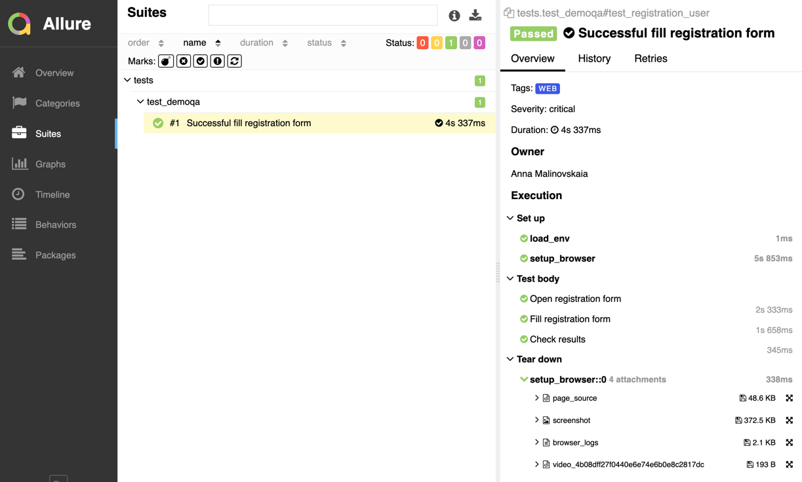

# 📁 Урок "Jenkins"

1. Практика. Создаем задачу (Job), связываем с репозиторием в Github, запускаем тесты удаленно
2. Теория. Основы Jenkins
3. Теория. Основы CI/CD

[Конспект лекции](https://github.com/qa-guru/knowledge-base)

## Задание

1. Взять свой код для http://demoqa.com/automation-practice-form
2. Добавить аттачи для Allure – скриншот, page source, console.log и видео
3. Cделать сборку в Jenkins

## Решение
1. [Сборка в Jenkins](https://jenkins.autotests.cloud/job/student-malinovskaia-anna-qa-guru-6-12-jenkins/29/)
2. [Allure отчёт](https://jenkins.autotests.cloud/job/student-malinovskaia-anna-qa-guru-6-12-jenkins/29/allure/)

