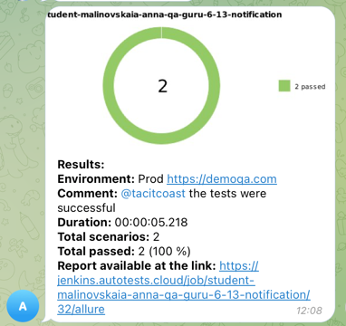

# 📁 Урок "Telegram bot. Отправляем уведомления о результатах прохождении автотестов"

1. Изучает Telegram API, отправляем запросы
2. Постобработка сборки. Настраиваем отправку уведомлений в Jenkins
3. Теория. Мониторинг

[Конспект лекции](https://github.com/qa-guru/knowledge-base)

[Библиотека Allure notifications](https://github.com/qa-guru/allure-notifications)

## Задание

1. Возьмите свой проект с автотестами.
2. Создайте задачу в Jenkins.
3. Зарегистрируйте бота в Telegram, создайте чат и добавьте бота в него.
4. Добавьте бота к вашему проекту.

## Решение
1. [Сборка в Jenkins](https://jenkins.autotests.cloud/job/student-malinovskaia-anna-qa-guru-6-13-notification/32/)
2. [Allure отчёт](https://jenkins.autotests.cloud/job/student-malinovskaia-anna-qa-guru-6-13-notification/32/allure/)
3. [Telegram chat с отчетами](https://t.me/+2cMW1AfsMLhkZTUy)

